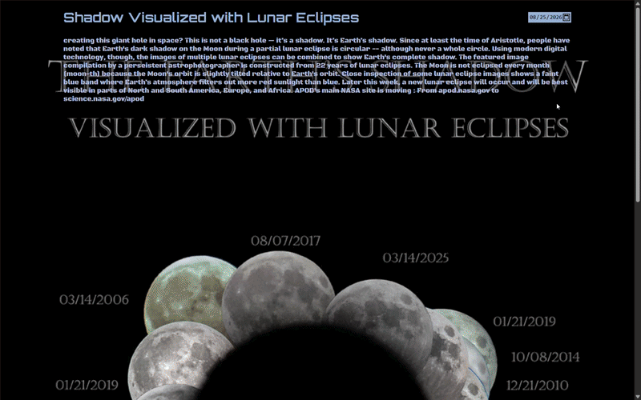

## Tabbo
A minimalist viewer for NASA's daily image - pick any date and see what NASA published for that day, from images to videos.

## Try it
[Live demo](https://jasur0407.github.io/tabbo/)

## Quick start
Open the live link above, pick a date with the datepicker, and the media for that day displays automatically.

## Features
- View NASA's picture of the day for any date
- Renders images, direct & YouTube video files depending on the media of that day
- Datepicker's maximum is fixed to today, so you can't pick a future date
- Animated title and explanations are pulled straight from NASA's archive of media

## How it works
Tabbo is a small vanilla JS + Vite app. On load and on every date change it calls NASA's API directly. Since APOD(Astronomy Picture Of the Day) entries can be an image, a YouTube video, or a video file, Tabbo checks `media_type` to decide whether to render an ``, `<iframe>`, or `<video>` tag. The text is animated using Javascript `Promise` and `setInterval` to split up the passage into words and display them one by one; explanation animation waits for the title's animation to be finished before it starts playing.

## Credits
- [NASA APOD API](https://api.nasa.gov/) for daily media, title and explanations
- Fonts: [Orbitron](https://fonts.google.com/specimen/Orbitron) and [Black Ops One](https://fonts.google.com/specimen/Black+Ops+One) from Google Fonts